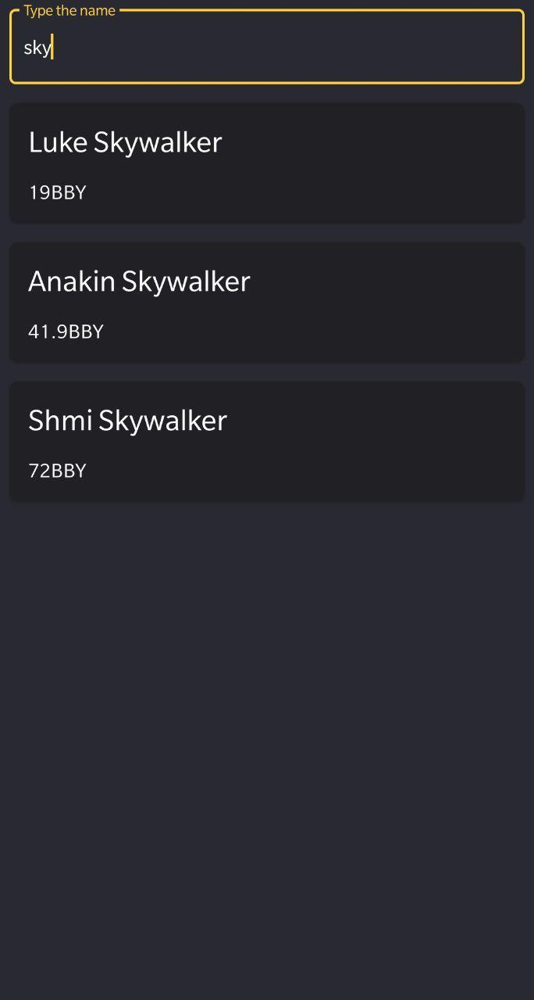
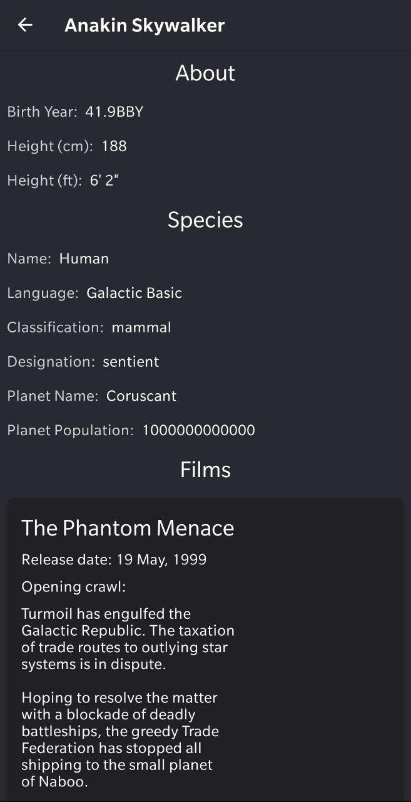

# Star Search
The project is based on [Star Wars API](https://swapi.co) and allows you to find any Star Wars character and get a detailed information about them.

 

## Technologies used
- Single Activity application pattern, as it is highly flexible and scales better than the Multi-Activity approach
- Koin for DI
- For the architecture I have decided to pick [spotify/mobius](https://github.com/spotify/mobius/) with MVI approach. The framework also allows you to combine it with any other pattern (MVP, MVVM, MV*).
- [Conductor](https://github.com/bluelinelabs/Conductor) as a replacement for fragments. 
- Retrofit, Gson for networking
- RxKotlin
- RxBinding for transforming clicks/UI changes into Events
- [mikepenz/FastAdapter](https://github.com/mikepenz/FastAdapter) for universal RecyclerView adapter.
- JUnit and mockk for testing
- LeakCanary for tracking potential leaks
